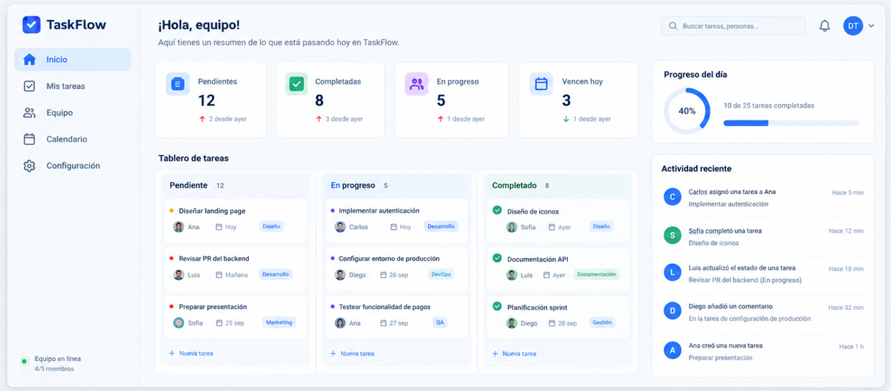
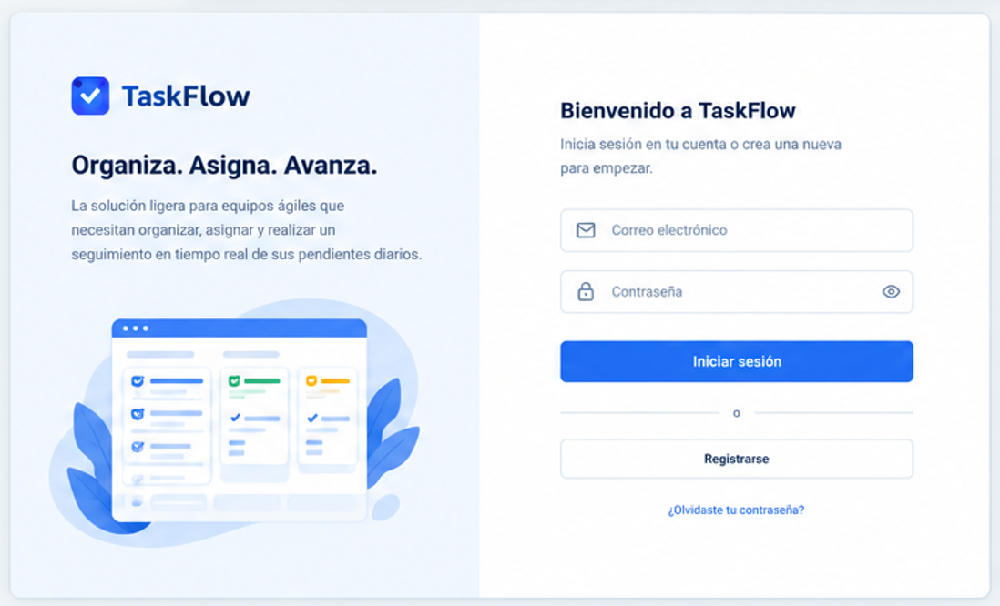
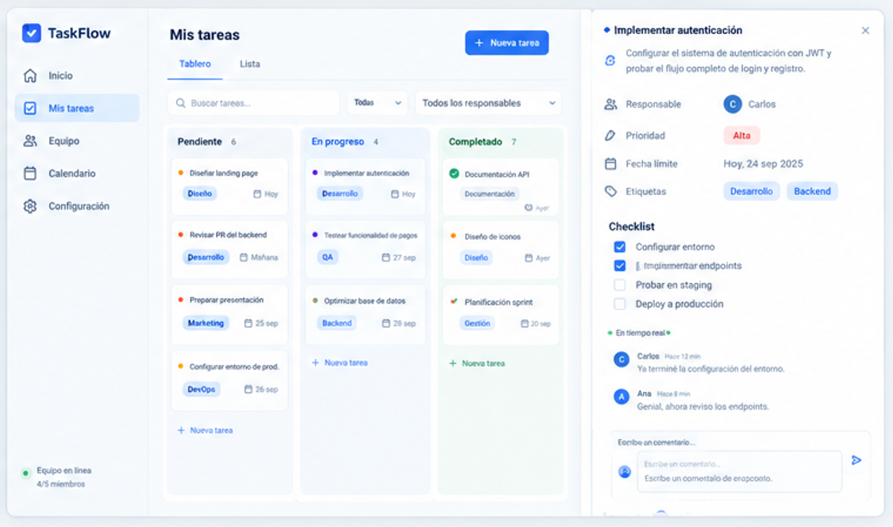
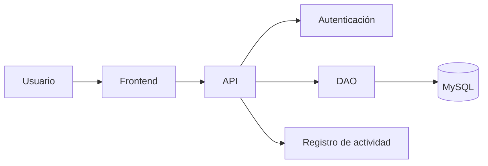

# TaskFlow

## Badges(Medallas)
[](https://github.com/usuario/taskflow/commits)
[](https://github.com/usuario/taskflow/issues)
[](https://github.com/usuario/taskflow/stargazers)
[](LICENSE)

> Aplicación web colaborativa y sencilla para administrar y optimizar las tareas de tu equipo de trabajo.

## Tabla de contenido
- [Descripción](#-descripción)
- [Funcionalidades](#-funcionalidades)
- [Tecnologías](#-tecnologías)
- [Instalación](#-instalación)
- [Uso](#-uso)
- [Contribuidores](#-contribuidores)

---

## Descripción
**TaskFlow** es una solución ligera diseñada para equipos ágiles que necesitan organizar, asignar y realizar un seguimiento en tiempo real de sus pendientes diarios. Su interfaz intuitiva permite mantener el flujo de trabajo sincronizado y sin fricciones

## Funcionalidades
* **Gestión de tareas:** Creación, edición y eliminación de pendientes de forma rápida
* **Asignación de usuarios:** Distribución de responsabilidades entre los miembros del equipo
* **Filtros avanzados:** Búsqueda por estado, prioridad o responsable
* **Modo oscuro:** Interfaz adaptada para reducir la fatiga visual

---

## Tecnologías utilizadas
A continuación se detallan las principales tecnologías empleadas en el desarrollo de TaskFlow:

| Categoría | Tecnología | Versión | Propósito |
| :--- | :--- | :--- | :--- |
| **Frontend** | HTML5 / CSS3 | 5 / 3.0 | Estructura y diseño base de la interfaz |
| **Lógica** | JavaScript (ES6+) | ES2024 | Interactividad y gestión de eventos |
| **Estilos** | Tailwind CSS | 3.4.x | Framework de clases utilitarias |
| **Control de versiones**| Git & GitHub | Latest | Control de código fuente y colaboración |

---

## Requisitos
Navegador web moderno (Google Chrome, Firefox, Edge o Brave).

Conexión a internet estable.

Entorno con soporte para ejecución local (Node.js 18.0+ recomendado).

---

## Instalación
Sigue los pasos a continuación para configurar y ejecutar el proyecto en tu entorno local:

1. Clonar el repositorio
2. Configurar la base de datos
3. Configurar las variables necesarias
4. Ejecutar la aplicación

---

## Uso
Una vez que la aplicación esté en marcha, abre tu navegador web e ingresa para empezar a crear tableros y gestionar las tareas del equipo de forma colaborativa

---

## 🖼️ Capturas de pantalla
A continuación se muestran las principales interfaces de la aplicación para facilitar la comprensión visual a los nuevos desarrolladores:

### Pantalla principal


### Inicio de sesión / Registro


### Gestión de tareas


---

## Arquitectura
La aplicación está organizada en diferentes componentes que permiten gestionar la interacción con el usuario, la autenticación, el acceso a datos y el registro de actividades[cite: 7].



---
## Estructura del proyecto

```text
taskflow/
├── docs/
├── src/
│   ├── components/
│   └── views/
├── .env.example
├── package.json
└── README.md
```

---

## Contribuidores
* **Equipo de Desarrollo © TaskFlow**

---

## Licencia
Este proyecto está bajo la Licencia MIT. Consulta el archivo LICENSE para más detalles.